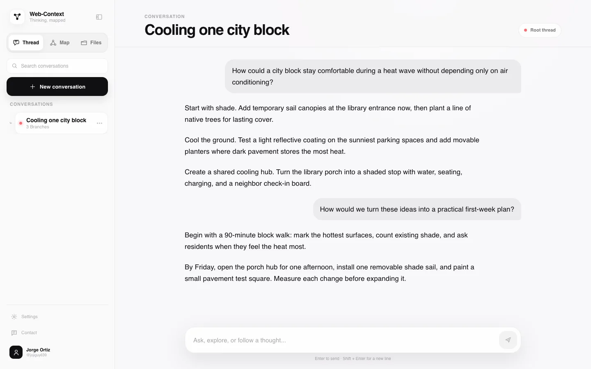
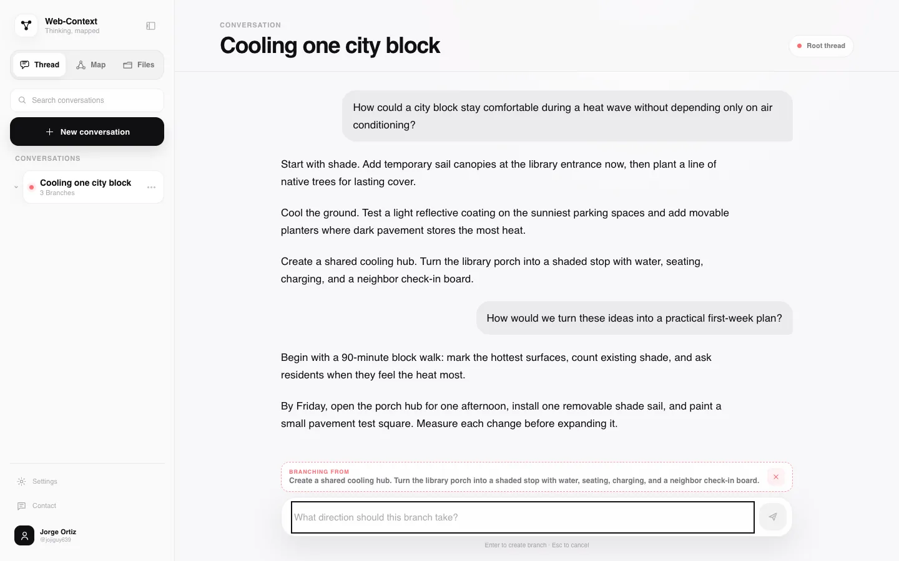
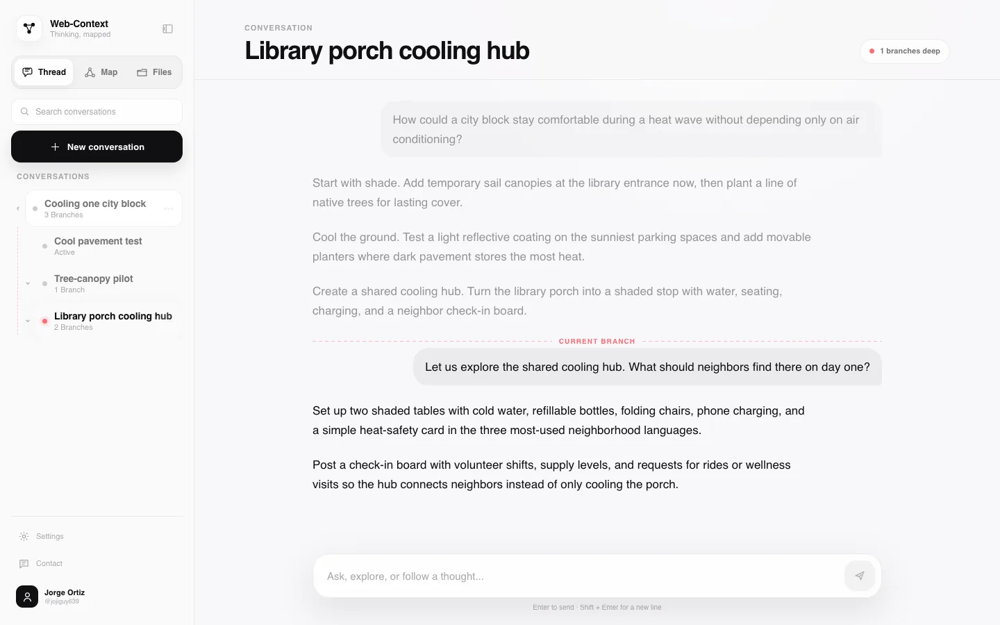
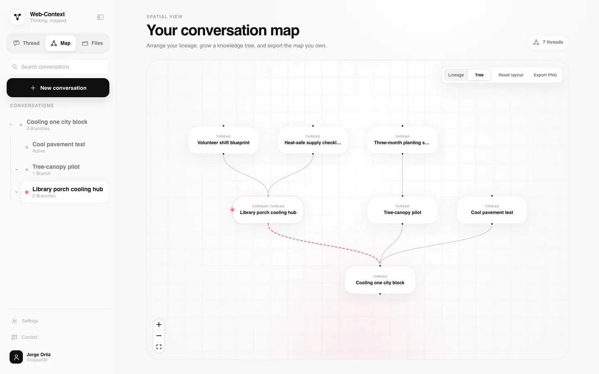
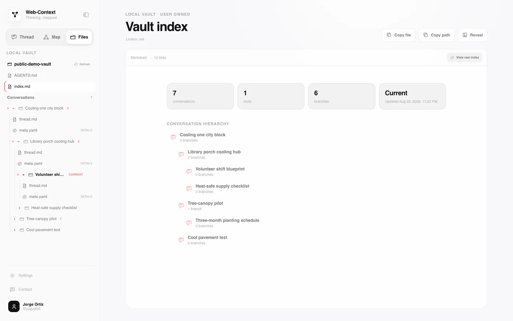

# Lineage App

[](https://github.com/ortizjorge639/web-context-graph/actions/workflows/ci.yml)
[](LICENSE)

**Branch agent conversations into knowledge you own.**

Lineage App is a trusted, single-user, local-first agent conversation workspace. FastAPI serves the React interface on localhost, each GitHub Copilot CLI response becomes addressable Markdown blocks, and a branch can begin from any whole block while preserving its root-to-fork lineage and excluding sibling branches.

The interface is a view over a durable Knowledge Tree you own: `thread.md` stores conversation content, `meta.yaml` stores authoritative relationships, `index.md` is a regenerable discovery cache, and `AGENTS.md` explains the vault contract to other agent harnesses. Every mutation is committed to the vault's local Git history.

**Product landing:** [https://ortizjorge639.github.io/web-context-graph/](https://ortizjorge639.github.io/web-context-graph/)

> Lineage App is the product name. `web-context-graph` remains the repository slug and legacy technical name.

## Quickstart

Lineage App runs locally on Windows, macOS, and Linux. The UI runs in a modern browser; the host machine runs the backend and Copilot CLI.

### Prerequisites

- Git
- Python 3.11+
- Node.js 22+
- GitHub Copilot CLI with active Copilot access
- A modern browser

Clone the repository and authenticate the CLI once:

```bash
git clone https://github.com/ortizjorge639/web-context-graph.git
cd web-context-graph
copilot login
```

Optionally choose a different vault directory, then start.

On macOS or Linux:

```bash
export WCG_VAULT_ROOT="$HOME/my-lineage-vault"
./scripts/run-local.sh
```

On Windows PowerShell:

```powershell
$env:WCG_VAULT_ROOT = "$env:USERPROFILE\my-lineage-vault"
.\scripts\run-local.ps1
```

Without `WCG_VAULT_ROOT`, data lives in `~/web-context-graph-data/`. The launcher checks for Python, npm, Git, and `copilot`; creates the backend virtual environment if needed; installs project dependencies; builds the frontend; binds FastAPI to `127.0.0.1`; and opens the browser. It does not clone the repository, install system tools, provide Copilot access, or authenticate your account.

Set `PORT` to choose a different local port, or set `WCG_NO_OPEN=1` to start the server without opening a browser. Copilot CLI calls default to a 5-minute quiet-output timeout; set `WCG_COPILOT_TIMEOUT_SECONDS` if your local agent regularly needs more time to respond.

## How it works

1. **Branch a block.** Each agent response is split into addressable Markdown blocks, with list items treated as separate branchable slices. Choose a whole block or item to begin the next request from that exact point.
2. **Preserve lineage.** The child thread receives root-to-fork context and continues independently; sibling branch content is excluded.
3. **Navigate the tree.** Map/Knowledge Tree views let you trace branches, return to a node, branch again, and open conversations.
4. **Own the artifact.** Plain Markdown and YAML remain useful outside the interface, while local Git records every mutation.

New root conversations open directly to the composer. The initial placeholder title is replaced from the first user request so you can start writing without naming the thread first.

Arbitrary highlighted-text or span branching is not implemented. Branching is block/list-item level today.

## Screenshots

Current captures from one coherent Lineage App journey:

**Linear thread** - begin with a normal Copilot conversation.



**Branch from a block** - anchor a new prompt to one addressable response block.



**Isolated child context** - carry root-to-fork context into the child without sibling content.



**Knowledge Tree** - trace branches, return to any node, and open its conversation.



**Files and local vault** - inspect the durable Markdown, YAML, index, and folder hierarchy.



## Promotional media

Watch [Follow a thought. — the 23-second cinematic reel](media/promo/lineage-cinematic.mp4),
built with Three.js and rendered by HyperFrames
([reproducible source](media/promo/lineage-cinematic/)).
The [original 17-second highlight reel](media/promo/lineage-app-highlight-reel.mp4)
and its [editable project](media/promo/lineage-app-highlight-reel/) remain available.

## Data, Git, and agent access

The vault defaults to `~/web-context-graph-data/` and can be changed with `WCG_VAULT_ROOT` when launching. It is separate from this source repository.

- `threads/<thread-id>/thread.md` contains Markdown role messages.
- `threads/<thread-id>/meta.yaml` is the structural source of truth.
- `index.md` is regenerated by scanning metadata and is never authoritative.
- `AGENTS.md` teaches external agent harnesses to discover threads, reconstruct root-to-current lineage, stop at recorded fork blocks, and exclude siblings.
- `graph-layout.json`, when present, stores presentation state only.

Existing `AGENTS.md` files are intentionally never overwritten. New vaults receive a guide that users can extend.

The Files view can reveal vault folders and files in the host file manager. It opens Finder on macOS, File Explorer on Windows, and the default file manager on Linux.

Lineage App initializes and commits to a local Git repository automatically. It does **not** configure or push to a GitHub remote. You may add and push your own remote manually; use a private repository when conversations may contain sensitive information.

## Provider and security boundaries

Lineage App invokes the installed and authenticated GitHub Copilot CLI directly as a subprocess with `--no-remote`. It does not use the Copilot SDK, has no arbitrary-provider adapter, and supports GitHub Copilot CLI only today. Available models come from your Copilot CLI account.

Do not expose the backend publicly. This is a trusted localhost app, and the current Copilot invocation has broad local tool access. The backend accepts only `localhost` and `127.0.0.1` Host headers (with any local port), rejecting non-local hosts before routing so a DNS-rebinding origin cannot become same-origin with the API. Browser JSON mutations are also limited to the documented local development origins by CORS, while no-Origin local CLI clients remain supported. A hosted multi-user service would require authentication, isolated workers, restricted tools, encrypted credentials, quotas, audit logging, and remote storage that do not exist here.

Copilot usage, subscriptions, model availability, and billing remain governed by GitHub.

## Manual development

Run the backend:

```bash
cd backend
python3 -m venv .venv
.venv/bin/pip install -r requirements.txt
.venv/bin/uvicorn main:app --reload
```

Run the frontend in a separate terminal:

```bash
cd frontend
npm install
npm run dev
```

## Test

```bash
# Backend fast suite (no real Copilot CLI calls)
cd backend
.venv/bin/pytest -v --ignore=test_smoke_e2e.py --ignore=test_copilot_engine.py

# Frontend
cd ../frontend
npm test
npm run lint
npm run build
```

The full backend suite runs real authenticated Copilot CLI integration tests:

```bash
cd backend
.venv/bin/pytest -v
```

## FAQ

### What exactly is Lineage App?

A local-first browser workspace for branching GitHub Copilot CLI conversations at addressable response blocks and preserving the resulting lineage as a plain-file Knowledge Tree.

### Is it a desktop app or hosted service? What devices and platforms work today?

Neither. FastAPI serves a React web UI on localhost, and the host machine runs the backend and agent. The Bash launcher supports macOS and Linux-style environments. There is no supported native-Windows launcher and no hosted multi-user service.

### Which agents, models, and providers are supported?

GitHub Copilot CLI only. Lineage App invokes the installed CLI directly; it is not provider-neutral. Model availability follows the user's Copilot account and CLI.

### What do I need before starting?

Git, Python 3.11+, Node.js 22+, GitHub Copilot CLI with active access and authentication, and a modern browser on a macOS or Linux-style environment.

### Does the one-command launcher install everything?

No. After prerequisites, clone/download, and Copilot authentication are ready, `./scripts/run-local.sh` handles project dependencies, the production frontend build, localhost startup, and opening the browser.

### Where is my data, and how do I choose the directory?

The default is `~/web-context-graph-data/`. Set `WCG_VAULT_ROOT` before launching to use another directory.

### Does it sync to GitHub?

Not automatically. Each mutation is committed to local Git. You may configure and push a remote yourself; a private remote is recommended for sensitive conversations.

### Why not use NotebookLM or an LLM wiki?

NotebookLM is excellent for source-grounded synthesis, while LLM wikis can compile documents into useful pages and links. Lineage App solves a different problem: keeping you in control while knowledge is explored.

Every branch is a deliberate choice; its parent and fork point remain visible, sibling contexts stay isolated, and the complete tree remains inspectable as local Markdown, YAML, and Git history. It does not make AI infallible - it makes the path from question to answer auditable, revisable, and yours. The tools can complement one another.

### Can another agent harness consume the vault?

Yes. `AGENTS.md` documents discovery through `index.md`, authoritative relationships in `meta.yaml`, conversation content in `thread.md`, and the rule for reconstructing lineage without sibling leakage.

### Is it safe to expose publicly?

No. Keep it on trusted localhost. Copilot currently runs with broad local tool access.

### Is highlighted-text branching supported?

No. Responses are addressable at the Markdown block level. Arbitrary highlighted spans are future work.

### Is it free and open source?

The source is licensed under [GNU AGPL-3.0-or-later](LICENSE). Copilot access, usage, subscription, and billing are governed separately by GitHub.

## Architecture and invariants

- `/edit` changes one thread in place and never cascades.
- `/refork` recursively deletes the selected child branch before creating its replacement.
- Creating a fork updates both child `forked_from` and parent `forked_children`.
- Rendering computes deterministic positional chunk IDs (`<thread-id>#c<order>`) from `thread.md` without rewriting stored Markdown.
- Backend mutations rebuild `index.md` and autocommit the external vault.
- Copilot session IDs are one-to-one with threads, and assembled context is root-to-current with siblings excluded.

See [`docs/plans/2026-08-27-web-context-graph-mvp.md`](docs/plans/2026-08-27-web-context-graph-mvp.md) for the legacy Web-Context Graph implementation decisions.

## License

Copyright (C) 2026 Jorge Ortiz Flores.

Lineage App is free software licensed under the [GNU Affero General Public License v3.0 or later](LICENSE). Modified versions offered over a network must make their corresponding source available under the license.
