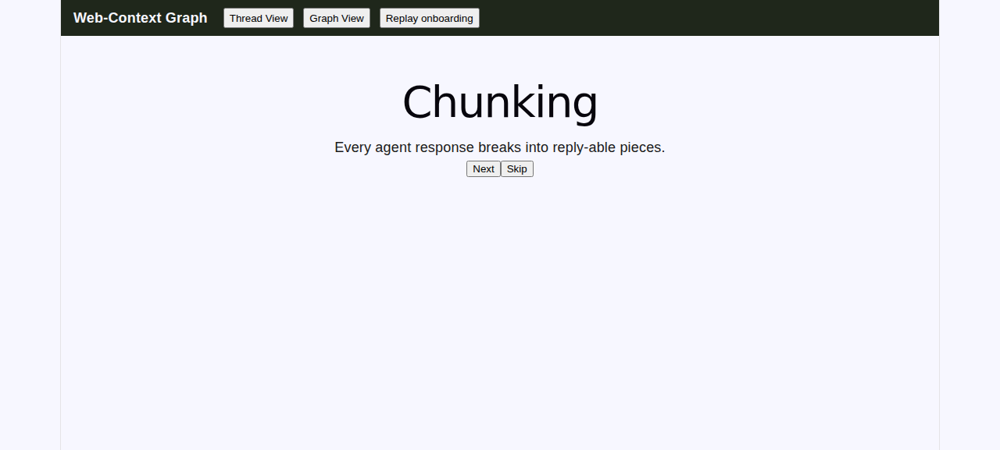
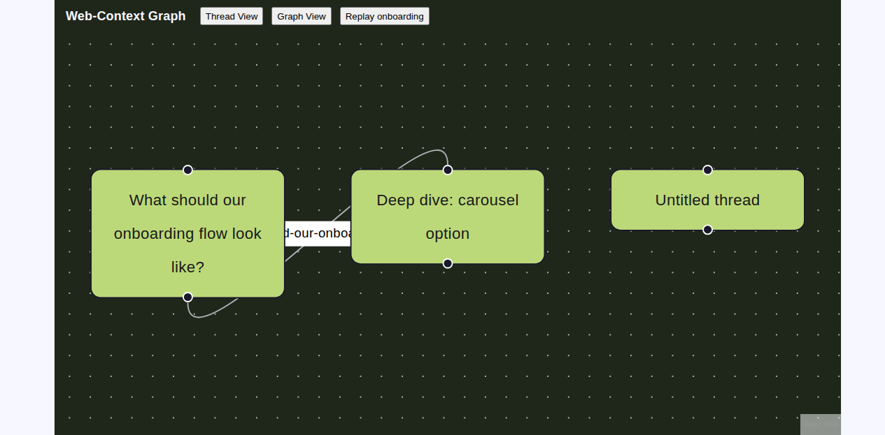
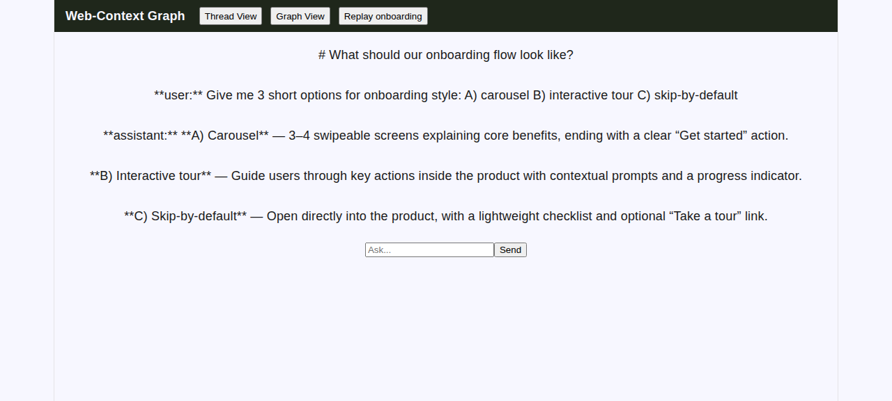

# Web-Context Graph

Spider-style branching conversation graph, powered by GitHub Copilot CLI as the reasoning engine. Reply to any chunk of an agent's response and it forks a new thread from that exact point; backtrack freely; the whole traversal persists as a folder-of-markdown graph you own, with an auto-updating index and a visual Graph View.

**Public product landing:** [https://ortizjorge639.github.io/web-context-graph/](https://ortizjorge639.github.io/web-context-graph/)

See `docs/plans/2026-08-27-web-context-graph-mvp.md` for the implementation plan, and the spec it implements (Jorge's Obsidian vault, `Projects/Web-Context-Graph/Web-Context-Graph-Spec.md`).

## Screenshots

Live captures from the running Phase 1 MVP (real backend data, real Copilot CLI responses):

**Onboarding carousel** — Raycast-style, one mechanic per screen, skippable:



**Graph View** — real threads and a real fork edge, rendered via react-flow. Clicking a node opens that thread:



**Thread View** — chunked agent output (block-level), opened by clicking the corresponding node in Graph View:



## Prerequisites

- Python 3.11+
- Node 18+
- GitHub Copilot CLI installed and authenticated (`copilot --version` should work)

## Run

```bash
# Backend
cd backend
python3 -m venv .venv
.venv/bin/pip install -r requirements.txt
.venv/bin/uvicorn main:app --reload

# Frontend (separate terminal)
cd frontend
npm install
npm run dev
```

## Deploy locally

The supported MVP deployment is a single-user localhost application. It uses
the Copilot CLI account already authenticated on the machine, keeps the vault
under `~/web-context-graph-data/`, builds the frontend, and serves the complete
application from FastAPI:

```bash
./scripts/run-local.sh
```

The launcher installs missing project dependencies, builds the production
frontend, binds only to `127.0.0.1:8000`, and opens the app. Set `PORT` to use a
different local port, or `WCG_VAULT_ROOT` to use another vault directory.

Before launching, authenticate once with:

```bash
copilot login
```

Copilot calls are attributed to the GitHub account represented by the local CLI
credential. Headless credentials can instead be supplied through
`COPILOT_GITHUB_TOKEN`, `GH_TOKEN`, or `GITHUB_TOKEN`. Current monthly plans use
token-based GitHub AI Credits; annual plans may remain on premium-request
accounting until renewal. The app's displayed token metrics are informational;
GitHub Billing is authoritative.

This release is intentionally local and single-user. Do not expose the backend
to the public internet: the agent currently runs with broad local tool access.
A hosted multi-user service requires isolated workers, per-user authentication
and encrypted credentials, restricted tools, quotas, audit logging, and remote
storage.

## Test

```bash
# Backend fast tests (no real Copilot CLI calls)
cd backend && .venv/bin/pytest -v --ignore=test_smoke_e2e.py --ignore=test_copilot_engine.py

# Backend full suite (slower -- hits real Copilot CLI)
cd backend && .venv/bin/pytest -v

# Frontend
cd frontend && npm test
```

## Data location

User graph data lives in `~/web-context-graph-data/` by default — not this repo. That folder is the user's actual content, auto-committed to its own local git repo after every mutation as a safety net for the app's absolute-delete-on-refork semantics.

Every vault is initialized with an `AGENTS.md` navigation contract for external
agents. It instructs them to use `index.md` for discovery, treat each thread's
`meta.yaml` as structural authority, read `thread.md` for conversation content,
reconstruct lineage root-to-current through recorded fork chunks, and exclude
sibling branches. The generated guide also documents safe mutation and index
regeneration rules. Existing `AGENTS.md` customizations are never overwritten.
