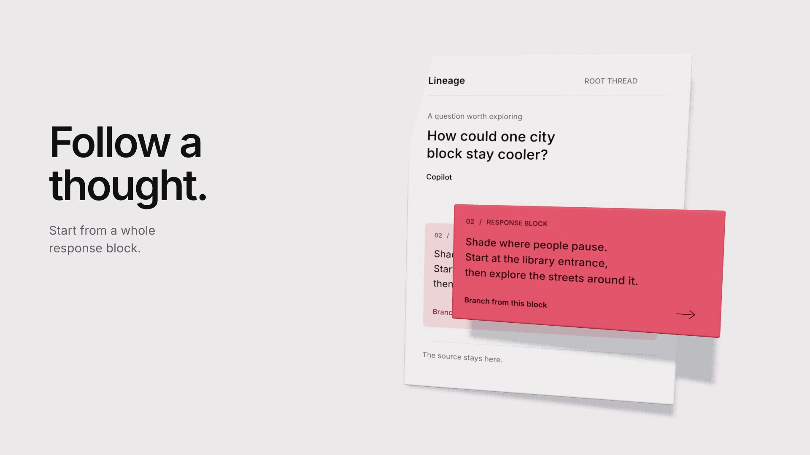

# Follow a thought.

The second Lineage App film: [watch the MP4](../lineage-cinematic.mp4).
A continuous Three.js camera journey, not a screenshot montage.
The [first reel](../lineage-app-highlight-reel/) is unchanged.



## Committed storyboard

| Time | Shot language | What it proves |
| --- | --- | --- |
| 0-4s | Macro on a thin, porcelain-white conversation page. One entire coral response block lifts off its inset; its type and edges stay tangible. | A whole addressable block is the fork point, not selected text. |
| 4-8s | A lateral camera track follows the coral branch into a new child page, then settles with both pages visible. | The child carries its root-to-fork path; the source stays intact. |
| 8-13.5s | A deliberate dolly out reveals the same pages as a sculptural single-parent tree. Full conversations distill into readable map titles. Only one root-to-current route is coral. | Separate sibling branches, no convergence or merging. |
| 13.5-18.8s | The camera concentrates on the three selected-path conversations. Each exposes its own Markdown/YAML pair; other branches leave the frame independently. | These are the existing local files, not a merged answer or export operation. |
| 18.8-23s | The scene recedes under a dark lockup and a single stem splitting into two children. Everything is settled by 19.6s. | Exact tagline, local-first/open-source/CLI-beta boundary and useful URL; 3.4s readable final hold. |

Warm white, charcoal and coral inherit the established site identity. Satin
paper edges, room-light reflections and actual cast shadows supply
depth. Typography remains unblurred; important narration is HTML. The first
frame is already composed. No music, stock imagery, private user data or
application server is involved. All example conversation text is synthetic.

Mode: Persuade. Audience: people exploring questions with Copilot CLI who want
branchable conversations and durable local ownership. The film makes no claim
of arbitrary-span selection, merging, hosted sync, multiuser access, multiple
providers, or hallucination prevention.

## Reproduce

Requires Node.js 22+, npm, FFmpeg/ffprobe, and a Chromium browser capable of
WebGL 2. All dependencies are composition-local, exact-versioned and locked.
No backend, Copilot invocation, private vault, or network asset fetch is used.

```bash
cd media/promo/lineage-cinematic
npm ci
npx hyperframes browser ensure
npm run lint
npm run check
npm run snapshot
npm run render
npm run deliver
npm run review
```

`render` writes the HyperFrames original to ignored
`renders/lineage-cinematic.mp4`. `deliver` stream-copies it to
`../lineage-cinematic.mp4`, places `moov` before `mdat`, records the verified
installed renderer version, and asserts media specs, size and full decoding.
No frames are re-encoded or generated by the delivery script. HyperFrames
0.8.10 currently emits its internal version tag as `0.0.0-dev`; the remux
corrects that tag to the installed `0.8.10`, not a different renderer.

Interactive timeline and seeking:

```bash
npm run dev
# Open http://localhost:3217/#project/lineage-cinematic
npm run verify
npx hyperframes preview --stop
```

HyperFrames Studio starts its own preview service; the stop command ends this
composition's service. Studio may add stable `data-hf-id` attributes to its
source HTML. The verification script uses this local preview, blocks nonlocal
asset requests, and exercises the same seek event used by the render adapter.
Override `LINEAGE_PREVIEW_URL` if using a different preview port/project ID.

To watch the delivered MP4 without Studio, serve the media directory in a
separate terminal (this never starts the app server):

```bash
cd media/promo
python3 -m http.server 3218 --bind 127.0.0.1
# Open http://127.0.0.1:3218/lineage-cinematic.mp4
```

Contact sheets and full-size frames are generated from the actual MP4:

```bash
cd media/promo/lineage-cinematic
node scripts/review.mjs ../lineage-cinematic.mp4 review/final
# review/final/contact-sheet.jpg and time-named PNGs
```

## Rendering architecture

`scene.js` authors every mesh, paper texture, light, camera pose and path.
Six synthetic nodes define five directed edges, with one root and exactly one
parent per child. The same objects persist across macro, map and file states.
The selected block is a separate beveled mesh above its retained source inset;
its minimum clearance is checked. File paths arch above the YAML leaves to
avoid intersections. No physical simulation or cumulative scene update runs.

One paused GSAP timeline declares 23 seconds. `hf-seek` invokes `renderAt(t)`
synchronously, including when the runtime suppresses GSAP callbacks.
Every pose, visibility, material crossfade, label position and draw range is
an absolute function of `t`. Quintic easing settles each purposeful move; there
is no wall-clock animation, uncontrolled randomness, looping bob or idle spin.
Fonts, procedural textures, room lighting and the first WebGL draw are ready
before the module registers the timeline. The renderer uses a fixed 1920x1080
buffer, pixel ratio 1, `preserveDrawingBuffer`, neutral tone mapping, a shared
2048px shadow map, shared geometries/materials, and local 1536px paper textures.

HyperFrames captures real WebGL frames in headless Chromium. Its experimental
DOM fast-capture path is explicitly disabled; normal screenshot capture is used.
The delivered movie used ANGLE Metal on macOS. On a machine without a usable
GPU, append `--no-browser-gpu` to the render command for documented SwiftShader
capture. The verification script uses SwiftShader for stable same-backend
pixel comparisons. Different Chromium/GPU versions can change antialiasing;
reproducible timing is not a claim of byte-identical video across machines.

## Provenance

- All conversation examples, geometry, texture layouts and animation are
  authored for this film. No private conversation, screenshots, stock models,
  remote HDRIs, music or external API is used.
- Palette and system-like typography follow `site/styles.css` and the current
  Lineage interface. Local Inter Variable is deliberately used as a portable,
  SF-like sans, avoiding machine-dependent font substitution. Its SIL Open
  Font License ships in the pinned `@fontsource-variable/inter` package.
- Three.js `RoundedBoxGeometry` and `RoomEnvironment` come from its MIT-licensed
  pinned package; the latter supplies only offscreen lighting.
- HyperFrames 0.8.10 renders the frames; GSAP 3.14.2 exposes the paused timeline;
  Three.js 0.185.1 does the visual work. Their licenses remain in their packages.
- Direction and implementation: GPT-6 Astra, with one bounded visual critique,
  a batched revision, and subsequent technical geometry repairs.

## Delivery and limitations

23.000 seconds, 1920x1080, 60 fps, 1,380 frames; silent H.264 High Profile,
`yuv420p`, BT.709, progressive-download fast-start. Approximately 6.5 MB, under
the 15 MB target and 25 MB hard limit. The last 3.4 seconds are a deliberate hold.
The v1 reel is preserved byte-for-byte.

The 20-frame review sheet includes beginnings, transition boundaries, macro,
wide and file frames, and the final lockup. Technical coverage includes full
FFmpeg decoding, black-segment inspection, interpreted freeze detection, local
font loading, blocked remote asset requests, finite geometry, single-parent
acyclic topology and exact forward/backward/random-seek WebGL pixels plus
overlay-style comparison. Repeated frames during settled reading holds are
intentional, not removed to manufacture motion.

HyperFrames' DOM layout/contrast checks cover the HTML narration, **not** text
inside the canvas, material contrast, physical occlusion or product truth.
Those require the actual-frame review. This is a stylized product explanation,
not a recording of application UI, and small file-body text is supporting
texture at social size; the file names, branch titles and narration carry the
message.
